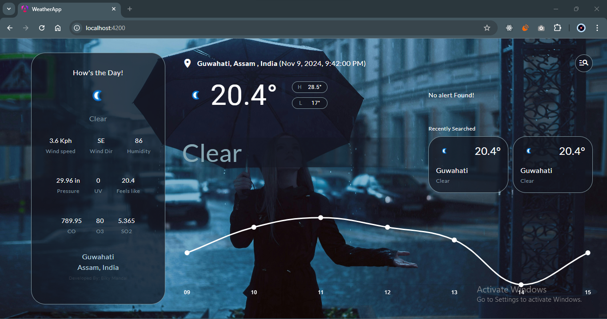
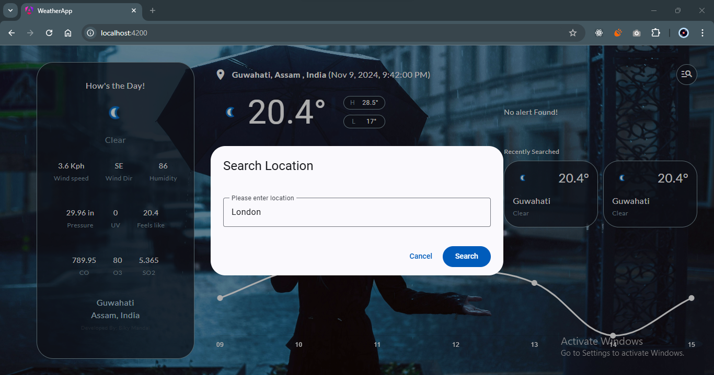
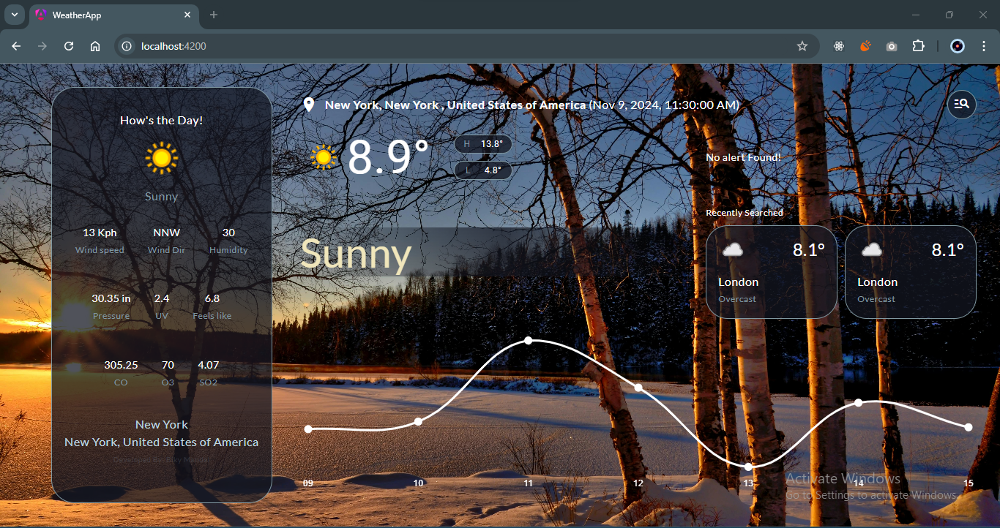
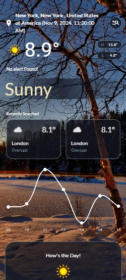
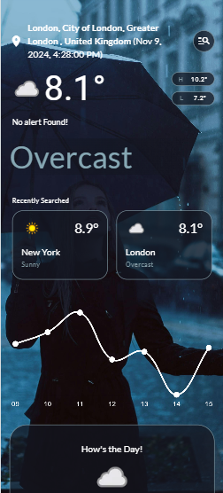

# WeatherApp

WeatherApp is a dynamic weather forecasting application built using Angular. It provides real-time weather updates by fetching data from a weather API, displaying current conditions, forecasts, and more.

## Features

- **Current Weather**: Displays the current weather conditions for a given location.
- **7-day Forecast**: Provides a 7-day weather forecast with detailed information on temperature, humidity, and wind speed.
- **Search Functionality**: Allows users to search for weather updates by city or location.
- **Responsive Design**: Optimized for both mobile and desktop devices.
- **API Integration**: Fetches weather data from a reliable third-party weather API.
- **Theme Mode**: Changing Theme based on Mode DAY | NIGHT

## Tech Stack

- **Frontend**: Angular
- **API**: OpenWeatherMap
- **Components**: Material UI
- **Chart**: Chart.js
- **Languages**: TypeScript, HTML, SCSS

## UI

